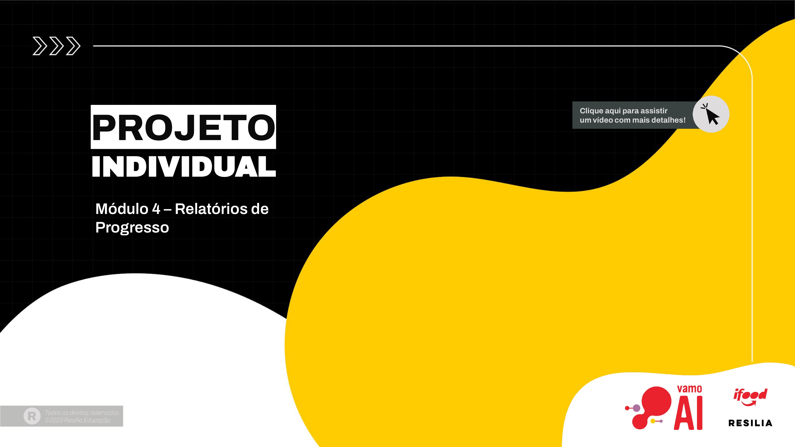

Este é o repositório do projeto de análise de progresso diário de uma empresa de desenvolvimento de softwares. O objetivo deste relatório é demonstrar a importância da análise dos dados de um projeto ao longo de uma semana, fornecendo insights sobre o progresso do projeto, identificando áreas de melhoria e tomando decisões informadas para garantir o sucesso do mesmo.

## Dados

A tabela abaixo apresenta os dados diários de horas trabalhadas, bugs corrigidos e tarefas concluídas:

| Dia      | Horas Trabalhadas | Bugs Corrigidos | Tarefas Concluídas |
|--------- |------------------ |-----------------|------------------- |
| segunda  | 6                 | 3               | 5                 |
| terça    | 7                 | 2               | 4                 |
| quarta   | 8                 | 1               | 6                 |
| quinta   | 6                 | 4               | 4                 |
| sexta    | 7                 | 3               | 5                 |
| sábado   | 5                 | 2               | 3                 |
| domingo  | 4                 | 1               | 2                 |

## Análise Exploratória

A análise exploratória dos dados foi realizada no Google Colab. Foram criados gráficos e tabelas para visualizar o progresso diário do projeto.

## Resultados

### Total de Horas Trabalhadas

O total de horas trabalhadas ao longo da semana foi de 43 horas.

### Média Diária de Horas Trabalhadas

A média diária de horas trabalhadas foi de 6.14 horas.

### Total de Bugs Corrigidos

Foram corrigidos um total de 16 bugs ao longo da semana.

### Média Diária de Bugs Corrigidos

A média diária de bugs corrigidos foi de 2.29 bugs.

### Total de Tarefas Concluídas

Um total de 29 tarefas foram concluídas durante a semana.

### Média Diária de Tarefas Concluídas

A média diária de tarefas concluídas foi de 4.14 tarefas.

### Produtividade Diária

A produtividade diária, medida pelo número de tarefas concluídas por hora, foi de 0.096 tarefas por hora.

## Insights

Com base na análise dos dados, podemos observar que a equipe de desenvolvimento trabalhou em média 6 horas por dia, corrigindo em média 2 bugs diariamente e concluindo cerca de 4 tarefas por dia. A produtividade diária indica que, em média, foram concluídas aproximadamente 9.6% das tarefas a cada hora trabalhada.

## Notebook

Para acessar o notebook com o código utilizado para a análise, consulte [projeto_individual.ipynb](/projeto_individual.ipynb))

## Aviso

Para executar o código no Google Colab, é necessário baixar o arquivo Relatorio.csv e colocá-lo na pasta correta para carregar os dados corretamente.

